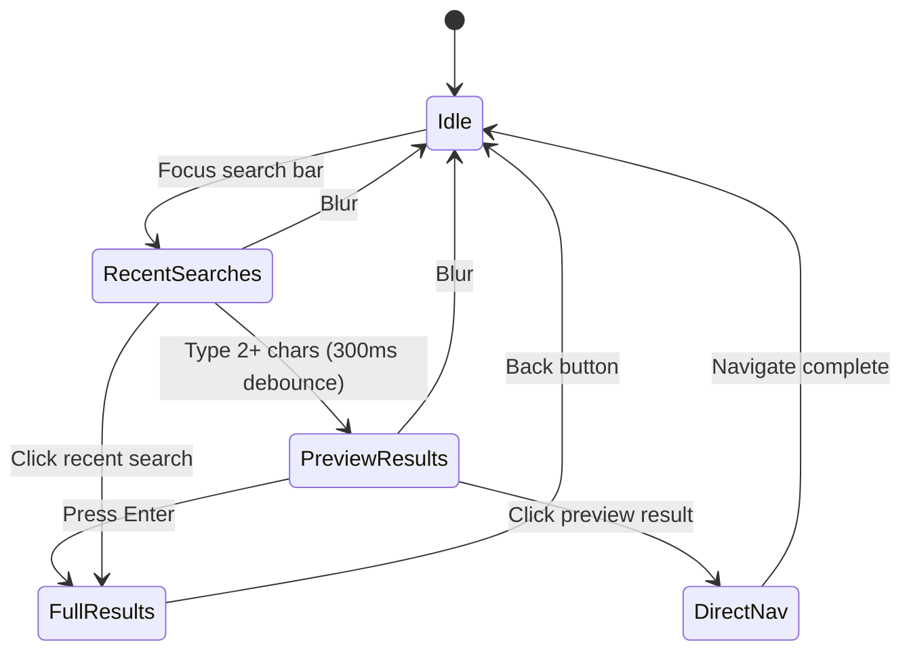

# Search Feature Implementation Plan

## Table of Contents
1. [Architecture Overview](#architecture-overview)
2. [Implementation Status](#implementation-status)
3. [Search UX Flow](#search-ux-flow)
4. [File Structure](#file-structure)
5. [Database Strategy](#database-strategy)
6. [Future Enhancements](#future-enhancements)

---

## Architecture Overview

```
┌─────────────────────────────────────────────────────────────────────────────┐
│                              PRESENTATION                                    │
│  ┌─────────────────┐   ┌──────────────────┐   ┌────────────────────────┐    │
│  │ SearchBarWidget │──▶│ SearchState      │──▶│ SearchOverlayWidget    │    │
│  │ (+ overlay)     │   │ Notifier         │   │ SearchResultsScreen    │    │
│  └─────────────────┘   └────────┬─────────┘   └────────────────────────┘    │
│                                 │                                            │
│              ┌──────────────────┼──────────────────┐                        │
│              ▼                  ▼                  ▼                        │
│     searchStateProvider   recentSearchesProvider   sharedPreferencesProvider│
└─────────────────────────────────────────────────────────────────────────────┘
                                  │
┌─────────────────────────────────▼───────────────────────────────────────────┐
│                              DOMAIN                                          │
│  ┌─────────────────────┐     ┌──────────────────────────┐                   │
│  │TextSearchRepository │     │RecentSearchesRepository  │                   │
│  │  (interface)        │     │  (interface)             │                   │
│  └─────────────────────┘     └──────────────────────────┘                   │
│                                                                              │
│  Entities: SearchResult, SearchQuery, SearchCategory,                       │
│            CategorizedSearchResult, RecentSearch                            │
└─────────────────────────────────────────────────────────────────────────────┘
                                  │
┌─────────────────────────────────▼───────────────────────────────────────────┐
│                               DATA                                           │
│  ┌─────────────────────────┐     ┌────────────────────────────────┐         │
│  │TextSearchRepositoryImpl │────▶│ FTS DataSource (SQLite FTS4)   │         │
│  │ - searchCategorizedPreview    └────────────────────────────────┘         │
│  │ - searchByCategory      │                                                │
│  └─────────────────────────┘     ┌────────────────────────────────┐         │
│                                  │NavigationTreeRepository         │         │
│  ┌─────────────────────────┐     │ (for metadata enrichment)       │         │
│  │RecentSearchesRepoImpl   │────▶└────────────────────────────────┘         │
│  │ (SharedPreferences)     │                                                │
│  └─────────────────────────┘                                                │
└─────────────────────────────────────────────────────────────────────────────┘
```

---

## Implementation Status

### ✅ Complete

| Component | Details |
|-----------|---------|
| **Domain Entities** | `SearchQuery`, `SearchResult`, `SearchCategory` (title/content/definition), `CategorizedSearchResult`, `RecentSearch` |
| **Repository Interfaces** | `TextSearchRepository` (with `searchCategorizedPreview`, `searchByCategory`), `RecentSearchesRepository` |
| **Data Layer** | `TextSearchRepositoryImpl` (FTS + nav tree enrichment), `RecentSearchesRepositoryImpl` (SharedPreferences) |
| **State Management** | `SearchState` (Freezed), `SearchStateNotifier` (mode-based flow), `SearchMode` enum |
| **UI Widgets** | `SearchBarWidget` (focus/blur overlay), `SearchOverlayWidget` (recent/preview), `SearchResultsScreen` (category tabs) |
| **Tests** | 10 unit tests passing |

### ⏳ Pending

- Generate FTS database (`cd tools && node bjt-fts-populate.js`)
- Better matched text highlighting in preview
- Additional tests for new categorized search
- Dictionary/Definition search (SearchCategory.definition)

---

## Search UX Flow

**Medium.com-inspired search experience:**



### Search Modes

| Mode | Trigger | Display |
|------|---------|---------|
| `idle` | Initial state / blur | Nothing |
| `recentSearches` | Focus search bar | Recent search history (max 5) |
| `previewResults` | Type 2+ chars | Categorized preview (max 3 per category) |
| `fullResults` | Press Enter | Full results screen with category tabs |

### UX Features

- **300ms debounce** for preview search
- **Categorized results** (Title → Content → Definition)
- **Direct navigation** from preview (no extra screen)
- **Recent searches** stored in SharedPreferences (max 10, LIFO)
- **Category tabs** in full results (Title / Content / Definition)

---

## File Structure

### Domain Layer

```
domain/
├── entities/search/
│   ├── search_query.dart           # Query parameters
│   ├── search_result.dart          # Single result + SearchCategory
│   ├── search_category.dart        # enum: title, content, definition
│   ├── categorized_search_result.dart  # Grouped results for preview
│   └── recent_search.dart          # Search history entry
└── repositories/
    ├── text_search_repository.dart     # Interface
    └── recent_searches_repository.dart # Interface
```

### Data Layer

```
data/
├── datasources/
│   └── fts_datasource.dart             # SQLite FTS4 queries
└── repositories/
    ├── text_search_repository_impl.dart    # FTS + tree enrichment
    └── recent_searches_repository_impl.dart # SharedPreferences
```

### Presentation Layer

```
presentation/
├── providers/
│   ├── search_mode.dart            # SearchMode enum
│   ├── search_state.dart           # SearchState + SearchStateNotifier
│   └── search_provider.dart        # Riverpod providers
├── widgets/
│   ├── search_bar_widget.dart      # Input + overlay integration
│   ├── search_overlay_widget.dart  # Recent/preview dropdown
│   └── search_results_widget.dart  # Results list (legacy)
└── screens/
    └── search_results_screen.dart  # Full results with tabs
```

---

## Database Strategy

### FTS Database Schema

```sql
-- Per-edition tables (e.g., bjt_fts, bjt_meta)
CREATE VIRTUAL TABLE bjt_fts USING fts4(text, content='');

CREATE TABLE bjt_meta (
  id INTEGER PRIMARY KEY,
  filename TEXT NOT NULL,   -- e.g., "dn-1"
  eind TEXT NOT NULL,       -- e.g., "0-5" (pageIndex-entryIndex)
  language TEXT NOT NULL,   -- "pali" or "sinh"
  type TEXT NOT NULL,       -- "paragraph", "heading"
  level INTEGER NOT NULL
);

CREATE TABLE bjt_suggestions (
  word TEXT PRIMARY KEY,
  language TEXT NOT NULL,
  frequency INTEGER NOT NULL
);
```

### Search Strategies

| Category | Method |
|----------|--------|
| **Title** | Navigation tree name matching (paliName, sinhalaName) |
| **Content** | FTS4 full-text search (bjt_fts table) |
| **Definition** | Future: Dictionary database |

---

## Key Design Decisions

| Decision | Rationale |
|----------|-----------|
| **Mode-based state** | Clean UX flow matching Medium.com pattern |
| **Categorized preview** | Reduces cognitive load (Miller's Law: 7±2 items) |
| **Title category first** | Serial Position Effect - prioritize common use case |
| **300ms debounce** | Doherty Threshold - feels responsive but avoids spam |
| **Enter for full results** | Explicit intent vs accidental navigation |
| **SharedPreferences for history** | Simple, sync with Supabase later |
| **48px+ tap targets** | Fitts's Law - mobile usability |

---

## Future Enhancements

### Short Term
- Matched text highlighting in preview
- Scroll to exact entry (currently page-level)
- Dictionary/Definition search integration

### Long Term
- Supabase sync for search history
- Boolean operators (AND, OR, NOT)
- Search analytics and ranking improvements
- SuttaCentral edition support

---

## Database Generation

```bash
cd tools
node bjt-fts-populate.js
```

Creates: `assets/databases/bjt-fts.db`
