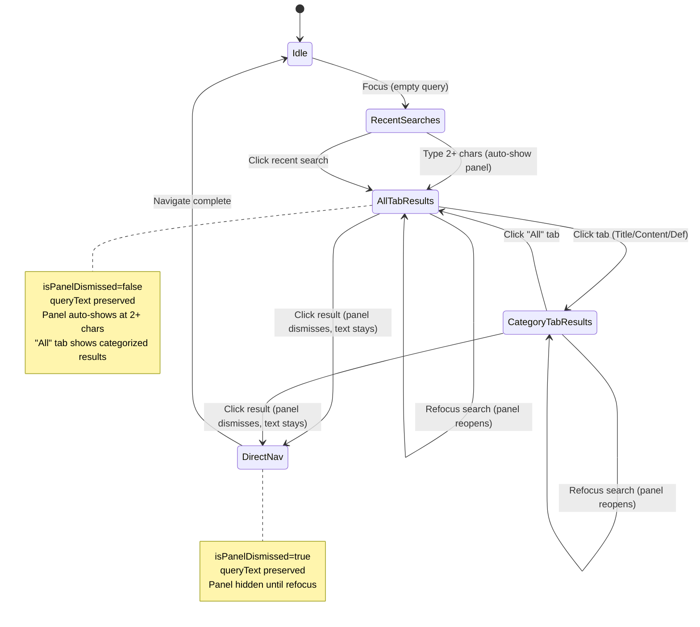

# Search Feature Implementation Plan

## Table of Contents
1. [Architecture Overview](#architecture-overview)
2. [UI Architecture](#ui-architecture)
3. [Implementation Status](#implementation-status)
4. [Search UX Flow](#search-ux-flow)
5. [File Structure](#file-structure)
6. [Database Strategy](#database-strategy)
7. [Future Enhancements](#future-enhancements)

---

## Architecture Overview

```
┌─────────────────────────────────────────────────────────────────────────────┐
│                              PRESENTATION                                    │
│  ┌─────────────────┐   ┌──────────────────┐   ┌────────────────────────┐    │
│  │ SearchBar       │──▶│ SearchState      │──▶│ RecentSearchOverlay    │    │
│  │ (+ overlay)     │   │ Notifier         │   │ SearchResultsPanel     │    │
│  └─────────────────┘   └────────┬─────────┘   └────────────────────────┘    │
│                                 │                                            │
│              ┌──────────────────┼──────────────────┐                        │
│              ▼                  ▼                  ▼                        │
│     searchStateProvider   recentSearchesProvider   sharedPreferencesProvider│
└─────────────────────────────────────────────────────────────────────────────┘
                                  │
┌─────────────────────────────────▼───────────────────────────────────────────┐
│                              DOMAIN                                          │
│  ┌─────────────────────┐     ┌──────────────────────────┐                   │
│  │TextSearchRepository │     │RecentSearchesRepository  │                   │
│  │  (interface)        │     │  (interface)             │                   │
│  └─────────────────────┘     └──────────────────────────┘                   │
│                                                                              │
│  Entities: SearchResult, SearchQuery, SearchCategory,                       │
│            CategorizedSearchResult, RecentSearch                            │
└─────────────────────────────────────────────────────────────────────────────┘
                                  │
┌─────────────────────────────────▼───────────────────────────────────────────┐
│                               DATA                                           │
│  ┌─────────────────────────┐     ┌────────────────────────────────┐         │
│  │TextSearchRepositoryImpl │────▶│ FTS DataSource (SQLite FTS4)   │         │
│  │ - searchCategorizedPreview    └────────────────────────────────┘         │
│  │ - searchByCategory      │                                                │
│  └─────────────────────────┘     ┌────────────────────────────────┐         │
│                                  │NavigationTreeRepository         │         │
│  ┌─────────────────────────┐     │ (for metadata enrichment)       │         │
│  │RecentSearchesRepoImpl   │────▶└────────────────────────────────┘         │
│  │ (SharedPreferences)     │                                                │
│  └─────────────────────────┘                                                │
└─────────────────────────────────────────────────────────────────────────────┘
```

---

## UI Architecture

### Responsive Layout

The search UI adapts based on screen width using `ResponsiveUtils`:

| Screen Width | Results Display |
|--------------|-----------------|
| **< 768px** (Mobile) | Full-screen panel |
| **≥ 768px** (Tablet/Desktop) | Side panel (~50% width, 350-500px) |

### Simplified Component Design

The search UI has two main components that show based on query state:

```
┌─────────────────────────────────────────────────────────────────────────────┐
│                    SearchState (single source of truth)                      │
│                                                                              │
│  ┌─────────────────────────────────────────────────────────────────────────┐│
│  │ queryText | isPanelDismissed | categorizedResults | fullResults          ││
│  │                                                                          ││
│  │ Computed: isResultsPanelVisible = queryText.length is NotEmpty && !isPanelDismissed ││
│  └─────────────────────────────────────────────────────────────────────────┘│
└─────────────────────────────────────────────────────────────────────────────┘
                                    │
            ┌───────────────────────┼───────────────────────┐
            │                       │                       │
            ▼                       │                       ▼
┌───────────────────────┐           │           ┌───────────────────────┐
│   SearchBar           │           │           │   ReaderScreen        │
│   (OverlayPortal)     │           │           │   (Stack)             │
│                       │           │           │                       │
│ Shows overlay when:   │           │           │ Shows panel when:     │
│ queryText is empty    │           │           │ isResultsPanelVisible │
└───────────────────────┘           │           └───────────────────────┘
            │                       │                       │
            ▼                       │                       ▼
┌───────────────────────┐           │           ┌───────────────────────┐
│ RecentSearchOverlay   │           │           │ SearchResultsPanel    │
│ (recent searches only)│           │           │ (4 tabs: All + 3 cats)│
└───────────────────────┘           │           └───────────────────────┘
```

### State-Driven Behavior

The `isPanelDismissed` flag enables smart UX when clicking results:

| Previous Action | On Focus | Result |
|----------------|----------|--------|
| No previous search | Focus | Shows recent searches overlay |
| Typed 2+ chars | Auto | Shows results panel with "All" tab |
| Clicked result | Auto | Panel closes, queryText preserved |
| Refocus search bar | Focus | Panel reopens with existing results |
| Cleared search (X) | Auto | Fresh state, shows recent searches |

### Panel Design (Desktop ≥768px)

```
┌──────────────────────────────────────────────────────────────────────────┐
│ AppBar: [≡] ─────────────────────────────────────────── [🔍 Search] [⚙] │
├──────────────────────────────────────────────────────────────────────────┤
│                                        │░░░░░░░░░░░░░░░░░░░░░░░░░░░░░░░░│
│  ┌─────────────┐  ┌─────────────────┐  │░░░┌────────────────────────┐░░░│
│  │ Navigator   │  │ Reader Content  │  │░░░│ Search Results Panel   │░░░│
│  │ (350px)     │  │ (dimmed 54%)    │  │░░░│                        │░░░│
│  │             │  │                 │  │░░░│ [✕] Results for "metta"│░░░│
│  │             │  │                 │  │░░░├────────────────────────┤░░░│
│  │             │  │                 │  │░░░│ All│Title│Content│Def  │░░░│
│  │             │  │                 │  │░░░├────────────────────────┤░░░│
│  │             │  │                 │  │░░░│ TITLE MATCHES          │░░░│
│  │             │  │                 │  │░░░│ • Result 1             │░░░│
│  │             │  │                 │  │░░░│ CONTENT MATCHES        │░░░│
│  │             │  │                 │  │░░░│ • "...highlighted..."  │░░░│
│  └─────────────┘  └─────────────────┘  │░░░└────────────────────────┘░░░│
│                                        │░░░░░░░░░░░░░░░░░░░░░░░░░░░░░░░░│
└──────────────────────────────────────────────────────────────────────────┘
                                          ▲
                                          │ Dim barrier (tap to close)
                                          │ Panel width: 350-500px
```

### Interaction Patterns

| Action | Desktop | Mobile |
|--------|---------|--------|
| Type 2+ chars | Side panel auto-shows | Full-screen panel auto-shows |
| Click dim barrier | Dismisses panel | N/A |
| Press Escape | Dismisses panel | N/A |
| Android back | Dismisses panel | Dismisses panel |
| Click result | Opens doc + dismisses panel (text stays) | Opens doc + dismisses panel (text stays) |
| Refocus search | Panel reopens with results | Panel reopens with results |
| Clear (X button) | Resets all state | Resets all state |

---

## Implementation Status

### ✅ Complete

| Component | Details |
|-----------|---------|
| **Domain Entities** | `SearchQuery`, `SearchResult`, `SearchCategory` (all/title/content/definition), `CategorizedSearchResult`, `RecentSearch` |
| **Repository Interfaces** | `TextSearchRepository` (with `searchCategorizedPreview`, `searchByCategory`), `RecentSearchesRepository` |
| **Data Layer** | `TextSearchRepositoryImpl` (FTS + nav tree enrichment), `RecentSearchesRepositoryImpl` (SharedPreferences) |
| **State Management** | `SearchState` (Freezed + `isPanelDismissed`), `SearchStateNotifier` (simplified flow), computed `isResultsPanelVisible` |
| **UI - Search Bar** | `SearchBar` (OverlayPortal, state-synced TextField, auto-show panel at 2+ chars) |
| **UI - Recent Searches** | `RecentSearchOverlay` (simplified overlay with only recent searches) |
| **UI - Results Panel** | `SearchResultsPanel` (side panel on desktop, full-screen on mobile, 4 tabs: All/Title/Content/Definition) |
| **UI - All Tab** | Categorized results grouped by category with section headers |
| **Text Highlighting** | Proper Sinhala text highlighting with `_getEffectiveHighlightQuery` (Singlish→Sinhala conversion) |
| **Responsive Utils** | `ResponsiveUtils` (breakpoints: mobile <768px, tablet 768-1023px, desktop ≥1024px) |
| **Tests** | Unit tests passing for search state and results panel |

### ⏳ Pending

- Mobile-specific full-screen search experience (YouTube-style)
- Generate FTS database (`cd tools && node bjt-fts-populate.js`)
- Dictionary/Definition search (SearchCategory.definition)

---

## Search UX Flow

**Simplified, auto-showing panel experience:**



### Panel Visibility Logic

| Condition | Panel Visible | Display |
|-----------|---------------|---------|
| `queryText is empty` | ❌ | Recent searches overlay (if focused) |
| `queryText is not empty && !isPanelDismissed` | ✅ | Results panel (All tab by default) |
| `queryText is not empty && isPanelDismissed` | ❌ | Hidden (user clicked a result) |
| Refocus search bar | ✅ | Resets `isPanelDismissed`, shows panel |

### Category Tabs

| Tab | Content | Data Source |
|-----|---------|-------------|
| **All** | Categorized results grouped by category (Title matches, Content matches, etc.) | `categorizedResults` |
| **Title** | Full list of title matches only | `fullResults` (filtered by title) |
| **Content** | Full list of content matches with highlighted text | `fullResults` (filtered by content) |
| **Definition** | Dictionary/glossary matches (future) | `fullResults` (filtered by definition) |

### UX Features

- **300ms debounce** for search (reduces API calls)
- **Auto-show panel** at 2+ characters
- **Categorized "All" tab** - shows results grouped by category
- **Content highlighting** - only Content category results show highlighted matched text
- **Sinhala text support** - Singlish→Sinhala transliteration for highlighting
- **Direct navigation** from any result
- **Recent searches** stored in SharedPreferences (max 10, LIFO)
- **Search persistence** - query text remains after clicking result
- **Smart refocus** - panel reopens when search bar regains focus
- **Escape/Back to close** - keyboard and back button support

---

## File Structure

### Domain Layer

```
domain/
├── entities/search/
│   ├── search_query.dart           # Query parameters
│   ├── search_result.dart          # Single result
│   ├── search_category.dart        # enum: all, title, content, definition
│   ├── categorized_search_result.dart  # Grouped results for "All" tab
│   └── recent_search.dart          # Search history entry
└── repositories/
    ├── text_search_repository.dart     # Interface
    └── recent_searches_repository.dart # Interface
```

### Data Layer

```
data/
├── datasources/
│   └── fts_datasource.dart             # SQLite FTS4 queries
└── repositories/
    ├── text_search_repository_impl.dart    # FTS + tree enrichment
    └── recent_searches_repository_impl.dart # SharedPreferences
```

### Core Layer

```
core/
└── utils/
    ├── responsive_utils.dart       # ResponsiveUtils: isMobile(), isDesktop(), breakpoints
    ├── singlish_transliterator.dart # Singlish→Sinhala conversion for search
    └── text_utils.dart             # Text normalization for highlighting
```

### Presentation Layer

```
presentation/
├── providers/
│   ├── search_state.dart           # SearchState (Freezed) + SearchStateNotifier
│   └── search_provider.dart        # Riverpod providers
├── widgets/
│   ├── search_bar.dart             # SearchBar: Input + OverlayPortal + state sync
│   ├── recent_search_overlay.dart  # Recent searches overlay (simple dropdown)
│   └── search_results_panel.dart   # SearchResultsPanel: Side panel / full-screen results with 4 tabs
└── screens/
    └── reader_screen.dart          # Hosts SearchResultsPanel in Stack
```

---

## Database Strategy

### FTS Database Schema

```sql
-- Per-edition tables (e.g., bjt_fts, bjt_meta)
CREATE VIRTUAL TABLE bjt_fts USING fts4(text, content='');

CREATE TABLE bjt_meta (
  id INTEGER PRIMARY KEY,
  filename TEXT NOT NULL,   -- e.g., "dn-1"
  eind TEXT NOT NULL,       -- e.g., "0-5" (pageIndex-entryIndex)
  language TEXT NOT NULL,   -- "pali" or "sinh"
  type TEXT NOT NULL,       -- "paragraph", "heading"
  level INTEGER NOT NULL
);

CREATE TABLE bjt_suggestions (
  word TEXT PRIMARY KEY,
  language TEXT NOT NULL,
  frequency INTEGER NOT NULL
);
```

### Search Strategies

| Category | Method |
|----------|--------|
| **Title** | Navigation tree name matching (paliName, sinhalaName) |
| **Content** | FTS4 full-text search (bjt_fts table) |
| **Definition** | Future: Dictionary database |

---

## Key Design Decisions

| Decision | Rationale |
|----------|-----------|
| **Computed panel visibility** | Single source of truth: `queryText is not empty` eliminates mode tracking |
| **isPanelDismissed flag** | Allows closing panel while preserving query text for refocus |
| **"All" tab with categorized results** | Provides overview before drilling into specific categories |
| **Auto-show at 2+ chars** | Immediate feedback, no need to press Enter |
| **300ms debounce** | Doherty Threshold - feels responsive but avoids spam |
| **Title never highlighted** | Plain text display - highlighting only for content matches |
| **Content-only highlighting** | Only Content category results show matched text with highlights |
| **Sinhala text support** | Singlish→Sinhala conversion for proper highlighting of Unicode text |
| **SharedPreferences for history** | Simple, sync with Supabase later |
| **48px+ tap targets** | Fitts's Law - mobile usability |
| **Side panel vs full-screen** | Context preservation on desktop, focus on mobile |
| **Dim barrier on desktop** | Visual hierarchy, easy dismissal |
| **768px mobile breakpoint** | Tablets get side panel, phones get full-screen |
| **Recent searches only overlay** | Simplified - no preview results, panel shows full results |

---

## Recent Changes (Session Updates)

### Removed
- ❌ `SearchMode` enum (idle/recentSearches/previewResults/fullResults)
- ❌ `search_mode.dart` file
- ❌ `search_overlay.dart` (old preview overlay with categorized preview)
- ❌ `wasQuerySubmitted` flag (replaced with `isPanelDismissed`)
- ❌ `previewResults` field (no longer needed)
- ❌ Preview results overlay (typing now auto-shows full panel)

### Added
- ✅ `isPanelDismissed` flag for smart panel hiding on result click
- ✅ `isResultsPanelVisible` computed property
- ✅ `SearchCategory.all` enum value
- ✅ "All" tab in results panel with categorized/grouped results
- ✅ `recent_search_overlay.dart` (simplified recent searches only)
- ✅ `dismissResultsPanel()` method (closes panel but keeps query text)
- ✅ Proper Sinhala text highlighting with `_getEffectiveHighlightQuery`
- ✅ Title results no longer highlighted (plain text only)
- ✅ Content highlighting only for Content category results

### Updated
- 🔄 `SearchState` - removed mode/wasQuerySubmitted, added isPanelDismissed
- 🔄 `SearchStateNotifier` - simplified flow, no mode transitions
- 🔄 `SearchBar` - shows recent overlay when query < 2 chars
- 🔄 `SearchResultsPanel` - added "All" tab with categorized results
- 🔄 `_SearchResultTile` - content-only highlighting with Sinhala support
- 🔄 `ReaderScreen` - uses `isResultsPanelVisible` instead of mode check

---

## Future Enhancements

### Short Term
- Scroll to exact entry (currently page-level)
- Dictionary/Definition search integration
- Search analytics and ranking improvements

### Long Term
- Supabase sync for search history
- Boolean operators (AND, OR, NOT)
- SuttaCentral edition support
- Advanced filters (date ranges, text types)

---

## Database Generation

```bash
cd tools
node bjt-fts-populate.js
```

Creates: `assets/databases/bjt-fts.db`
