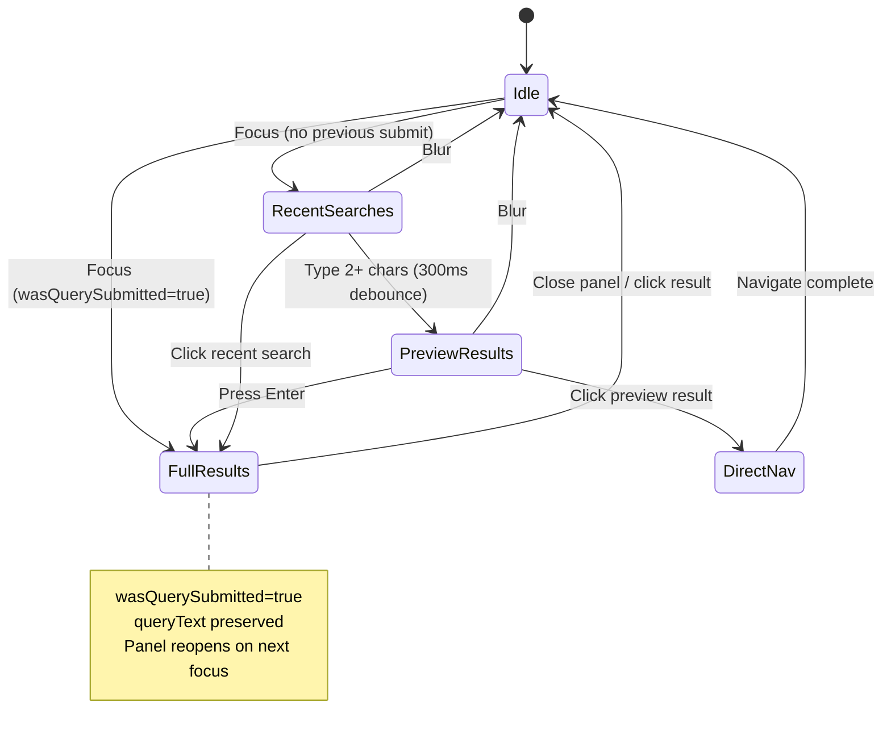

# Search Feature Implementation Plan

## Table of Contents
1. [Architecture Overview](#architecture-overview)
2. [UI Architecture](#ui-architecture)
3. [Implementation Status](#implementation-status)
4. [Search UX Flow](#search-ux-flow)
5. [File Structure](#file-structure)
6. [Database Strategy](#database-strategy)
7. [Future Enhancements](#future-enhancements)

---

## Architecture Overview

```
┌─────────────────────────────────────────────────────────────────────────────┐
│                              PRESENTATION                                    │
│  ┌─────────────────┐   ┌──────────────────┐   ┌────────────────────────┐    │
│  │ SearchBar       │──▶│ SearchState      │──▶│ SearchOverlayContent   │    │
│  │ (+ overlay)     │   │ Notifier         │   │ SearchResultsScreen    │    │
│  └─────────────────┘   └────────┬─────────┘   └────────────────────────┘    │
│                                 │                                            │
│              ┌──────────────────┼──────────────────┐                        │
│              ▼                  ▼                  ▼                        │
│     searchStateProvider   recentSearchesProvider   sharedPreferencesProvider│
└─────────────────────────────────────────────────────────────────────────────┘
                                  │
┌─────────────────────────────────▼───────────────────────────────────────────┐
│                              DOMAIN                                          │
│  ┌─────────────────────┐     ┌──────────────────────────┐                   │
│  │TextSearchRepository │     │RecentSearchesRepository  │                   │
│  │  (interface)        │     │  (interface)             │                   │
│  └─────────────────────┘     └──────────────────────────┘                   │
│                                                                              │
│  Entities: SearchResult, SearchQuery, SearchCategory,                       │
│            CategorizedSearchResult, RecentSearch                            │
└─────────────────────────────────────────────────────────────────────────────┘
                                  │
┌─────────────────────────────────▼───────────────────────────────────────────┐
│                               DATA                                           │
│  ┌─────────────────────────┐     ┌────────────────────────────────┐         │
│  │TextSearchRepositoryImpl │────▶│ FTS DataSource (SQLite FTS4)   │         │
│  │ - searchCategorizedPreview    └────────────────────────────────┘         │
│  │ - searchByCategory      │                                                │
│  └─────────────────────────┘     ┌────────────────────────────────┐         │
│                                  │NavigationTreeRepository         │         │
│  ┌─────────────────────────┐     │ (for metadata enrichment)       │         │
│  │RecentSearchesRepoImpl   │────▶└────────────────────────────────┘         │
│  │ (SharedPreferences)     │                                                │
│  └─────────────────────────┘                                                │
└─────────────────────────────────────────────────────────────────────────────┘
```

---

## UI Architecture

### Responsive Layout

The search UI adapts based on screen width using `ResponsiveUtils`:

| Screen Width | Preview (typing) | Full Results (Enter) |
|--------------|------------------|----------------------|
| **< 768px** (Mobile) | Dropdown overlay | Full-screen panel |
| **≥ 768px** (Tablet/Desktop) | Dropdown overlay | Side panel (~50% width) |

### Decoupled Component Design

The search overlay and results panel are **fully decoupled** - either can be removed without affecting the other:

```
┌─────────────────────────────────────────────────────────────────────────────┐
│                          SearchState (source of truth)                       │
│                                                                              │
│  ┌─────────────────────────────────────────────────────────────────────────┐│
│  │ queryText | mode | wasQuerySubmitted | previewResults | fullResults     ││
│  └─────────────────────────────────────────────────────────────────────────┘│
└─────────────────────────────────────────────────────────────────────────────┘
                                    │
            ┌───────────────────────┼───────────────────────┐
            │                       │                       │
            ▼                       │                       ▼
┌───────────────────────┐           │           ┌───────────────────────┐
│   SearchBar           │           │           │   ReaderScreen        │
│   (OverlayPortal)     │           │           │   (Stack)             │
│                       │           │           │                       │
│ Shows overlay when:   │           │           │ Shows panel when:     │
│ mode ≠ fullResults    │           │           │ mode == fullResults   │
└───────────────────────┘           │           └───────────────────────┘
            │                       │                       │
            ▼                       │                       ▼
┌───────────────────────┐           │           ┌───────────────────────┐
│ SearchOverlayContent  │           │           │ SearchResultsPanel    │
│ (dropdown preview)    │           │           │ (side/full panel)     │
└───────────────────────┘           │           └───────────────────────┘
```

### State-Driven Behavior

The `wasQuerySubmitted` flag enables smart UX:

| Previous Action | On Focus | Result |
|----------------|----------|--------|
| No previous search | Focus | Shows recent searches dropdown |
| Typed but no Enter | Focus | Shows preview dropdown |
| Pressed Enter | Focus | Reopens full results panel directly |
| Cleared search (X) | Focus | Fresh state, shows recent searches |
| Typed new query | Focus | Resets to preview mode |

### Panel Design (Desktop ≥768px)

```
┌──────────────────────────────────────────────────────────────────────────┐
│ AppBar: [≡] ─────────────────────────────────────────── [🔍 Search] [⚙] │
├──────────────────────────────────────────────────────────────────────────┤
│                                        │░░░░░░░░░░░░░░░░░░░░░░░░░░░░░░░░│
│  ┌─────────────┐  ┌─────────────────┐  │░░░┌────────────────────────┐░░░│
│  │ Navigator   │  │ Reader Content  │  │░░░│ Search Results Panel   │░░░│
│  │ (350px)     │  │ (dimmed 54%)    │  │░░░│                        │░░░│
│  │             │  │                 │  │░░░│ [✕] Results for "metta"│░░░│
│  │             │  │                 │  │░░░├────────────────────────┤░░░│
│  │             │  │                 │  │░░░│ Title│Content│Definition│░░│
│  │             │  │                 │  │░░░├────────────────────────┤░░░│
│  │             │  │                 │  │░░░│ • Result 1             │░░░│
│  │             │  │                 │  │░░░│ • Result 2             │░░░│
│  │             │  │                 │  │░░░│ • Result 3             │░░░│
│  └─────────────┘  └─────────────────┘  │░░░└────────────────────────┘░░░│
│                                        │░░░░░░░░░░░░░░░░░░░░░░░░░░░░░░░░│
└──────────────────────────────────────────────────────────────────────────┘
                                          ▲
                                          │ Dim barrier (tap to close)
                                          │ Panel width: 350-500px
```

### Interaction Patterns

| Action | Desktop | Mobile |
|--------|---------|--------|
| Press Enter | Side panel slides in | Full-screen panel |
| Click dim barrier | Closes panel | N/A |
| Press Escape | Closes panel | N/A |
| Android back | Closes panel | Closes panel |
| Click result | Opens doc + closes panel | Opens doc + closes panel |
| Clear (X button) | Resets all state | Resets all state |

---

## Implementation Status

### ✅ Complete

| Component | Details |
|-----------|---------|
| **Domain Entities** | `SearchQuery`, `SearchResult`, `SearchCategory` (title/content/definition), `CategorizedSearchResult`, `RecentSearch` |
| **Repository Interfaces** | `TextSearchRepository` (with `searchCategorizedPreview`, `searchByCategory`), `RecentSearchesRepository` |
| **Data Layer** | `TextSearchRepositoryImpl` (FTS + nav tree enrichment), `RecentSearchesRepositoryImpl` (SharedPreferences) |
| **State Management** | `SearchState` (Freezed + `wasQuerySubmitted`), `SearchStateNotifier` (mode-based flow), `SearchMode` enum |
| **UI - Search Bar** | `SearchBar` (OverlayPortal, state-synced TextField, mode-aware overlay display) |
| **UI - Preview Overlay** | `SearchOverlayContent` (recent searches, categorized preview, decoupled from panel) |
| **UI - Results Panel** | `SearchResultsPanel` (side panel on desktop, full-screen on mobile, category tabs) |
| **Responsive Utils** | `ResponsiveUtils` (breakpoints: mobile <768px, tablet 768-1023px, desktop ≥1024px) |
| **Tests** | 10 unit tests passing |

### ⏳ Pending

- Mobile-specific full-screen search experience (YouTube-style)
- Generate FTS database (`cd tools && node bjt-fts-populate.js`)
- Better matched text highlighting in preview
- Additional tests for new categorized search
- Dictionary/Definition search (SearchCategory.definition)

---

## Search UX Flow

**Context-preserving search experience:**



### Search Modes

| Mode | Trigger | Display |
|------|---------|---------|
| `idle` | Initial state / close panel | Nothing (search text may persist) |
| `recentSearches` | Focus (no query or new query) | Recent search history (max 5) |
| `previewResults` | Type 2+ chars | Categorized preview dropdown (max 3 per category) |
| `fullResults` | Press Enter OR refocus after submit | Side panel (desktop) / Full-screen (mobile) |

### State Flags

| Flag | Purpose |
|------|---------|
| `queryText` | Current search text (persists after closing panel) |
| `wasQuerySubmitted` | True if user pressed Enter; triggers panel reopen on focus |
| `mode` | Current UI mode (idle/recentSearches/previewResults/fullResults) |

### UX Features

- **300ms debounce** for preview search
- **Categorized results** (Title → Content → Definition)
- **Direct navigation** from preview (no extra screen)
- **Recent searches** stored in SharedPreferences (max 10, LIFO)
- **Category tabs** in full results (Title / Content / Definition)
- **Search persistence** - query text remains after clicking result
- **Smart refocus** - reopens panel if previous search was submitted
- **Escape/Back to close** - keyboard and back button support

---

## File Structure

### Domain Layer

```
domain/
├── entities/search/
│   ├── search_query.dart           # Query parameters
│   ├── search_result.dart          # Single result + SearchCategory
│   ├── search_category.dart        # enum: title, content, definition
│   ├── categorized_search_result.dart  # Grouped results for preview
│   └── recent_search.dart          # Search history entry
└── repositories/
    ├── text_search_repository.dart     # Interface
    └── recent_searches_repository.dart # Interface
```

### Data Layer

```
data/
├── datasources/
│   └── fts_datasource.dart             # SQLite FTS4 queries
└── repositories/
    ├── text_search_repository_impl.dart    # FTS + tree enrichment
    └── recent_searches_repository_impl.dart # SharedPreferences
```

### Core Layer

```
core/
└── utils/
    └── responsive_utils.dart       # ResponsiveUtils: isMobile(), isDesktop(), breakpoints
```

### Presentation Layer

```
presentation/
├── providers/
│   ├── search_mode.dart            # SearchMode enum (idle, recentSearches, previewResults, fullResults)
│   ├── search_state.dart           # SearchState (Freezed) + SearchStateNotifier
│   └── search_provider.dart        # Riverpod providers
├── widgets/
│   ├── search_bar.dart             # SearchBar: Input + OverlayPortal + state sync
│   ├── search_overlay.dart         # SearchOverlayContent: Recent/preview dropdown
│   ├── search_results_panel.dart   # SearchResultsPanel: Side panel / full-screen results
│   └── search_results_widget.dart  # Results list (legacy)
└── screens/
    ├── reader_screen.dart          # Hosts SearchResultsPanel in Stack
    └── search_results_screen.dart  # Full results with tabs (legacy - may be removed)
```

---

## Database Strategy

### FTS Database Schema

```sql
-- Per-edition tables (e.g., bjt_fts, bjt_meta)
CREATE VIRTUAL TABLE bjt_fts USING fts4(text, content='');

CREATE TABLE bjt_meta (
  id INTEGER PRIMARY KEY,
  filename TEXT NOT NULL,   -- e.g., "dn-1"
  eind TEXT NOT NULL,       -- e.g., "0-5" (pageIndex-entryIndex)
  language TEXT NOT NULL,   -- "pali" or "sinh"
  type TEXT NOT NULL,       -- "paragraph", "heading"
  level INTEGER NOT NULL
);

CREATE TABLE bjt_suggestions (
  word TEXT PRIMARY KEY,
  language TEXT NOT NULL,
  frequency INTEGER NOT NULL
);
```

### Search Strategies

| Category | Method |
|----------|--------|
| **Title** | Navigation tree name matching (paliName, sinhalaName) |
| **Content** | FTS4 full-text search (bjt_fts table) |
| **Definition** | Future: Dictionary database |

---

## Key Design Decisions

| Decision | Rationale |
|----------|-----------|
| **Mode-based state** | Clean UX flow with predictable transitions |
| **Categorized preview** | Reduces cognitive load (Miller's Law: 7±2 items) |
| **Title category first** | Serial Position Effect - prioritize common use case |
| **300ms debounce** | Doherty Threshold - feels responsive but avoids spam |
| **Enter for full results** | Explicit intent vs accidental navigation |
| **SharedPreferences for history** | Simple, sync with Supabase later |
| **48px+ tap targets** | Fitts's Law - mobile usability |
| **Side panel vs full-screen** | Context preservation on desktop, focus on mobile |
| **Decoupled overlay/panel** | Components can be removed/replaced independently |
| **wasQuerySubmitted flag** | Respects user intent - submitted searches reopen panel |
| **State-synced TextField** | Single source of truth prevents UI/state desync |
| **Dim barrier on desktop** | Visual hierarchy, easy dismissal |
| **768px mobile breakpoint** | Tablets get side panel, phones get full-screen |

---

## Future Enhancements

### Short Term
- Matched text highlighting in preview
- Scroll to exact entry (currently page-level)
- Dictionary/Definition search integration

### Long Term
- Supabase sync for search history
- Boolean operators (AND, OR, NOT)
- Search analytics and ranking improvements
- SuttaCentral edition support

---

## Database Generation

```bash
cd tools
node bjt-fts-populate.js
```

Creates: `assets/databases/bjt-fts.db`
