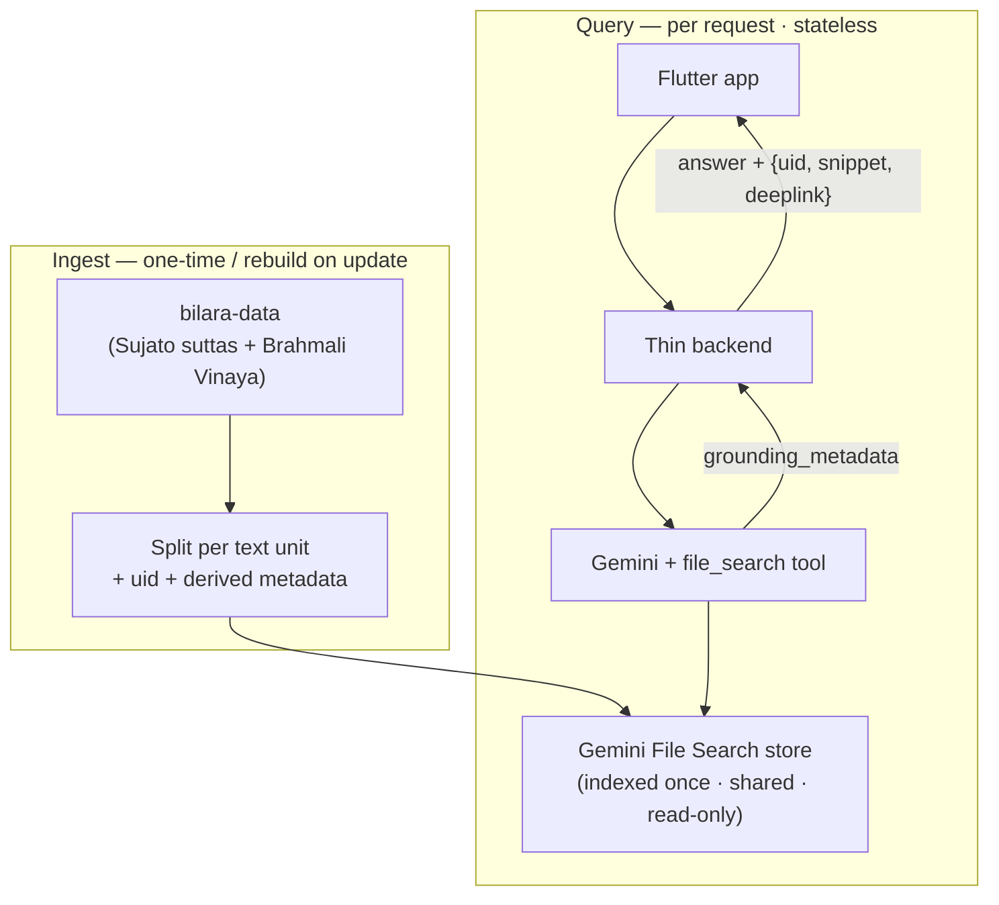

# Wisdom Project — AI Q&A Feature: Design & Handoff

**Status:** design agreed, prototype-ready
**Audience:** implementing developer or coding agent
**One-line:** a NotebookLM-style grounded Q&A over the Pali Canon, in Sinhala or English, with citations that deep-link back into the Wisdom Project app.

---

## 1. Goal & scope

A user asks a question about the canon and gets a grounded answer with citations; tapping a citation opens the relevant text **inside the app**.

**The workload is not pure text search** — it has a real reasoning component, and the generation layer is where that work happens. Question types to support, from observed usage:

- **Locating** — "which sutta says X." (One text, one answer.)
- **Thematic synthesis** — "what does the Buddha say about sleep", "definition of sexual misconduct." Treatment is scattered across many suttas and the Vinaya; the answer gathers and *organises* it (lay vs monastic, general vs detailed). **This is the centre of gravity, not the edge.**
- **Applied reasoning** — "is sex with a prostitute sexual misconduct?" Not on the formal list, but grouped under "downfalls"; the right answer draws the distinction instead of forcing a yes/no.
- **Scoped synthesis** — synthesis under a constraint ("don't connect it to how it's defined for nuns").
- **Honest absence** — "names of Sāriputta's siblings" → "the texts don't list them." Not answering is the right answer.
- **Follow-ups** — turns that depend on earlier ones (deferred in the prototype — §5.8).

**In scope:** all of the above, in Sinhala or English, answered in the **same language** as the question; citations resolved to **in-app deep links** (not suttacentral.net).

**Out of scope (v1):**
- **Adjudicating contested doctrine** — the narrow band ("is rebirth literal?", "what does *anattā* really mean?") where the question asks the model to *settle* a genuinely disputed meaning. The system prompt steers these toward "present what the texts say and where readings diverge," not a verdict (§11.4). Small slice, not the bread and butter.
- Per-user uploads / private notebooks — the corpus is fixed and shared.
- Authoritative Sinhala translation — the Sinhala answer is machine prose (§11.3).

---

## 2. Constraints (what we designed against)

1. **Low budget, free tier to start.** One-time costs OK; recurring cost near zero at low traffic, scaling sub-linearly.
2. **Low traffic now, must scale later** without re-architecting.
3. **Minimal infra ownership.** (The earlier Open Notebook + SurrealDB + Ollama path was rejected as too much to operate.)
4. **Single shared corpus, not multi-tenant.**
5. **Ephemeral sessions / clean-slate server.** No server-side per-user state.
6. **Citations must deep-link into the app.**

---

## 3. The key insight

The corpus is **fixed and shared**, not per-user uploads — the opposite of what NotebookLM / Open Notebook optimise for, which is why that path felt like fighting the tool. Consequence: **index once, query many.** The only persistent server-side asset is the index; there is no per-session ingestion, no per-user embedding, no conversation store.

---

## 4. Architecture overview

Two pipelines and a thin client.

- **Ingest** — run once, re-run on corpus updates; emits one indexed document per text unit. The accepted "high one-time cost."
- **Query** — per request, stateless: app → backend → managed retrieval + generation → citations mapped to deep links → app.



---

## 5. Component choices & rationale

### 5.1 Retrieval layer — Gemini File Search (managed RAG)
**Choice:** Google's fully-managed File Search for retrieval + grounding. It handles chunking, embedding, storage, retrieval, and citations, so we own no vector DB and run no embedding service — satisfying constraints 1–3. It returns structured citations (`grounding_metadata`) and supports per-document `custom_metadata`, both of which we need for deep links. Cost in §10.

**Rejected alternatives:**
- *Open Notebook / SurrealDB / Ollama* — too much infra (constraint 3).
- *Self-hosted vector DB + own embeddings (BGE-M3 + Pinecone/Turbopuffer/Upstash)* — more control and possibly better Sinhala/Pali embeddings, but more to run. **Kept as the documented fallback** (§12) because the API contract makes it swappable.

### 5.2 Corpus & ingest source — bilara-data, *not* the PDF
**Choice:** the SuttaCentral English translation from the **segmented `bilara-data` JSON**. It is **two trees, two translators, both CC0**: suttas (Bhikkhu Sujato) and Vinaya (Ajahn Brahmali). The Vinaya tree is **not optional** — money/monastic-rule questions need it. Both are public-domain (CC0): nothing to license, nothing to wait on.

**Why bilara-data, not the PDF:** the PDF is a rendering — citations would resolve to page numbers, and a chunk landing mid-text wouldn't even carry the heading. The JSON carries **stable segment ids** (`sn15.3:1.4`), which are the deep-link backbone. (The PDF names this source on its own credits page.)

Source `github.com/suttacentral/bilara-data`, `published` branch:
- Suttas: `translation/en/sujato/sutta/...` — uids `sn15.3`, `mn10`, `an3.80`.
- Vinaya: `translation/en/brahmali/vinaya/...` — uids `pli-tv-bu-vb-np18` (Vinaya · bhikkhu · vibhaṅga · nissaggiya pācittiya 18).
- Pali root text (`root/pli/ms/...`, same segment keys) — for Pali display later, not v1.

**Unit of indexing:** one document per text unit (sutta, or Vinaya rule/section). `display_name` = the uid → this rides into every citation as the chunk title, so deep-linking is `title → deeplinkFor(uid)`. **`deeplinkFor(uid)` and the app's routes must handle both id families** (`sn/mn/dn/an…` and `pli-tv-*`).

**Metadata is derived from the uid at ingest, never annotated onto the JSON.** The basket is a deterministic function of the uid prefix: `pli-tv-*` → `basket=vinaya` (`bu`/`bi` → division, `np` → rule-class); otherwise `basket=sutta` with nikaya from the leading letters. The script computes these and attaches them as `custom_metadata`. This is the single source of the "no extra data layer" approach referenced elsewhere (§5.9c, §8).

**Corpus scope — three separable trees:**
1. **Suttas** (Sujato) — *in.*
2. **Vinaya** (Brahmali) — *in.*
3. **Commentary** (Aṭṭhakathā) — **out (decided).** Not in bilara-data and mostly not CC0. Consequence to accept: many "what is the sutta where…" questions are actually commentarial narratives (the Mahādhana couple behind Dhp 155–156; the executed student of Sāriputta), and the tool will answer them honestly — "the *verse* is Dhp 155–156, but the *story* is commentarial and not in my sources" — as the samples did. Sourcing commentary remains a possible later project; not v1.

**Notes & introductions — out for now, addable later without a rebuild.** Two distinct artifacts, both Sujato's, both CC0, both *excluded by the current ingest globs* (which only match `translation/`):
- **Notes** = his annotations in the `comment/` layer (`comment/en/sujato/sutta/...`), segment-keyed like the translation (`dn10:1.2` → note), ~1,439 files (only annotated suttas).
- **Introductions** = per-collection front-matter HTML under `_publication/en/.../matter/*-introduction.html` — not segment-keyed.

Adding them later is **additive, not a re-index**: upload the `comment/` units as new documents (tagged `kind=note`, `source=sujato`) into the existing store; the suttas/Vinaya documents and the `/ask` contract are untouched. **Hard rule if they go in:** provenance must be labelled — the answer states "this is from Bhikkhu Sujato's note on SN 12.2," never blended into canonical-sounding text. The `kind=note` tag is what makes that enforceable on both the citation (rendered as a distinct "Note by…" source) and the generation side (system-prompt rule to attribute notes inline). See the `kind` field in §7.

### 5.3 Cross-lingual retrieval — translate the query
**Choice:** the corpus is English-only, so a Sinhala question is rewritten to an English search query *before* retrieval; English passes straight through. The problem is one-directional, and rewriting a short query is more reliable than trusting Sinhala embedding quality — it keeps that off the critical path. **Language detection is by Unicode block** (Sinhala = `U+0D80–U+0DFF`), a free regex, not an LLM call. This rewrite is the same call that contextualises follow-ups (§5.9a).

### 5.4 Answer language
**Choice:** answer in the language asked. This is purely a system-instruction setting; retrieval is unaffected. The model reads English passages and writes Sinhala when asked — the project already relies on exactly this pattern.

### 5.5 Citations → deep links (server-side)
The model never returns URLs, so there is nothing to "find and replace" — citations are **synthesised from `grounding_metadata`** on the server. Each grounding chunk's `retrieved_context.title` is the uid; `title → deeplinkFor(uid)` yields one `{uid, snippet, deeplink}` per source. The `snippet` is the English source span — it doubles as the verification preview (it's what the deep link opens).

**Linkifier (complementary):** regex the answer prose for canonical refs (`(SN|MN|DN|AN|…) \d+(\.\d+)?`) — these appear verbatim even in Sinhala answers — and resolve each against the known uid set, dropping refs that don't exist (§11.9). Same `deeplinkFor`. **Render as a footnote/source list, not inline-spliced links** (offset-splicing is fiddly and one span can map to several chunks).

### 5.6 Hybrid with existing FTS4
File Search is semantic-only, so exact proper nouns ("Aṅgulimāla", "Pāyāsi", a specific Pali term) are where it's weakest and the app's existing FTS4 index is strongest. Run both, merge, dedupe by uid. Reuses an asset you already have. (v1 thin add, or defer to v1.1.)

### 5.7 The backend — thin, stateless
A small stateless HTTP service. **Framework is the implementer's call** (suggestion: FastAPI on Cloud Run, or one Cloud Function — both scale to zero).

**Why a backend exists** (the app must never call Gemini directly):
- Keeps the API key and store name off the client.
- Houses language detection + rewrite, breadth/fan-out, and the citation→deep-link transform.
- **Reversibility anchor:** the app depends only on the `/ask` contract (§7), so the retrieval layer can be swapped (§5.1 fallback) with no app release. Protect this — it's what makes the validation gate (§12) cheap.

### 5.8 Sessions / state
The server is **stateless and stays that way**: no sessions, no timers, no TTL. It reads `history` from the request, answers, and forgets — so "when does a session clear?" is never a server question. Conversation, when present, is **client-owned**: the client replays prior turns in `history`, which the backend folds into contextualisation (§5.9a). "Clearing a thread" is therefore a client/UX choice (an explicit *New chat*), never a timer.

**Prototype scope (decided): no threads.** One chat window; each question independent; client sends empty `history`. Thread management and history window are deferred. Because the architecture is already multi-turn-capable, enabling follow-ups later is **zero server change** — the prototype just doesn't populate `history` yet, and the contract keeps the field.

### 5.9 Retrieval breadth & query contextualization
Where the "intelligent component" is engineered — three mechanisms, all in the backend, ahead of generation.

**(a) Query contextualization.** Rewrite the raw turn into a *standalone* query using `history`: "what about a prostitute?" → "is sex with a prostitute sexual misconduct, within the protected-women / downfalls framework?" Same call as the Sinhala→English rewrite (§5.3), so translation and de-referencing happen together. (Inactive in the prototype, which sends no history.)

**(b) Retrieval breadth by question type.** The dominant failure mode here is **silent incompleteness** (§11.1): a thematic question answered confidently over too few chunks. The lever is breadth, not suppression:
- A light **question-type classifier** sets breadth — narrow top-k for locators, wide for thematic.
- For thematic questions, **decompose into sub-queries** (sleep → sleep-as-hindrance, lion's posture, Vinaya bed rules, Māra taunts…) and **union** the chunks before generation.
- Instruct the model to **flag partial coverage** rather than imply exhaustiveness.

**(c) Explicit basket scoping.** Semantic retrieval already leans correctly toward the Vinaya for monastic-rule questions (the text is lexically distinctive), so most "in the Vinaya" questions resolve with no filter — and soft cross-basket reach is sometimes a feature. When the user **names a basket**, apply the uid-derived `basket` (§5.2) as a **hard metadata filter**. Strictly needed only for topics covered in *both* baskets (e.g. sexual misconduct: lay suttas vs monastic Vinaya).

> Direction of the fix: **widen retrieval under the synthesis**, don't stop the model synthesising. Tethered synthesis is the in-scope value (§1); the risk is too few passages, not reasoning.

---

## 6. Data flow — one query, end to end

1. App sends `{question, history, filters?}` to `/ask`. (Prototype: empty `history`.)
2. Detect language (Unicode regex).
3. **Contextualise + (if Sinhala) translate** in one rewrite call → standalone English search query (§5.9a).
4. **Classify breadth**; for thematic, **fan out** into sub-queries (§5.9b).
5. Call `generateContent` with the `file_search` tool per query, **unioning** chunks. System instruction sets answer language, glossary (Sinhala), and the "cite every claim / never invent / flag partial coverage / present-the-disagreement" rules.
6. Model returns a grounded answer + `grounding_metadata`.
7. Backend builds `{uid, snippet, deeplink}` citations and linkifies refs in prose (§5.5).
8. Return `{answer, lang, citations[]}`.
9. App renders; tapping a citation routes in-app.

---

## 7. API contract (stable interface — protect this)

The Flutter app binds only to this; keep it stable across retrieval-layer changes.

**Request** `POST /ask`
```json
{
  "question": "string (Sinhala or English)",
  "history":  [{"role": "user|assistant", "content": "string"}],   // empty in the prototype (§5.8)
  "filters":  {"basket": "vinaya"}                                  // optional metadata scope
}
```

**Response**
```json
{
  "answer": "string (same language as question)",
  "lang":   "si | en",
  "citations": [
    {
      "uid":      "sn15.3",
      "ref":      "SN 15.3",
      "kind":     "canon",                  // "canon" now; "note" reserved for Sujato's notes (§5.2)
      "snippet":  "English source span used to ground this point",
      "deeplink": "app://sutta/sn15.3"     // scheme TBD (§14)
    }
  ]
}
```

`deeplink` comes from the single pluggable `deeplinkFor(uid)`; changing the scheme must not change the contract shape. **Cheap insurance:** include `kind` from day one (always `"canon"` in the prototype). It costs nothing now and means the app is already structured to render a second source type when notes are added (§5.2) — no contract change, no app release.

---

## 8. Ingest specification

- **Source:** two trees on the `published` branch — `translation/en/sujato/sutta/**` and `translation/en/brahmali/vinaya/**`. (Optionally Sujato notes — §5.2.)
- **Unit:** one document per text-unit file.
- **Document text:** heading (`:0.*` segments) + body (remaining non-empty segments, in order), as clean prose — no ids inline for v1 (clean text embeds better). Segment anchors are a v2 concern.
- **`display_name`:** the uid (`sn15.3`, `pli-tv-bu-vb-np18`) — becomes the citation title; both schemes pass through unchanged.
- **`custom_metadata`:** all derived from the uid (§5.2) — `uid`, `basket`, `nikaya`/`division`, plus `samyutta`/`vagga`/`rule-class` as useful for `filters`; `kind=note` if notes are ingested.
- **Run mode:** one-time batch over both trees (thousands of files). **Idempotent and resumable** (skip uids already present), with retries/backoff.
- **Rebuild:** on translation updates, prefer rebuilding a fresh store and swapping the store name in config (blue/green) over in-place upsert.
- **Pre-flight:** check file-count / storage caps for the chosen tier against the two-tree size (Appendix A).

---

## 9. Reference implementation (illustrative — not prescriptive)

> Python + `google-genai`, to pin down shapes. Framework/language/SDK are the implementer's choice. Data below is real (SN 15.3, "Tears").

**Ingest — both trees → one document per unit**
```python
import json, glob, re, tempfile
from google import genai

client = genai.Client()
store = client.file_search_stores.create(config={"display_name": "tipitaka-en"})

globs = ["bilara-data/translation/en/sujato/sutta/**/*-sujato.json",      # suttas
         "bilara-data/translation/en/brahmali/vinaya/**/*-brahmali.json"]  # Vinaya

def meta_from_uid(uid):                                          # derived, never hand-annotated
    if uid.startswith("pli-tv-"):
        div = "bhikkhuni" if "-bi-" in uid else "bhikkhu" if "-bu-" in uid else None
        return {"basket": "vinaya", "division": div}
    return {"basket": "sutta", "nikaya": re.match(r"[a-z]+", uid).group()}

for g in globs:
    for path in glob.glob(g, recursive=True):
        segs = json.load(open(path))
        uid  = next(iter(segs)).split(":")[0]                   # "sn15.3" | "pli-tv-bu-vb-np18"
        head = " ".join(segs[k].strip() for k in segs if k.startswith(f"{uid}:0."))
        body = " ".join(segs[k].strip() for k in segs
                        if not k.startswith(f"{uid}:0.") and segs[k].strip())
        md   = {"uid": uid, **{k: v for k, v in meta_from_uid(uid).items() if v}}

        with tempfile.NamedTemporaryFile("w", suffix=f"_{uid}.txt", delete=False) as f:
            f.write(f"{head}\n{body}")
            tmp = f.name

        client.file_search_stores.upload_to_file_search_store(
            file_search_store_name=store.name, file=tmp,
            config={"display_name": uid,
                    "custom_metadata": [{"key": k, "string_value": v} for k, v in md.items()]},
        )
```

**Query — `/ask` core**
```python
import re
SINHALA = re.compile(r"[\u0D80-\u0DFF]")          # free language detect

GLOSSARY = ('saṁsāra→සංසාරය; transmigration→සංසරණය; '
            'charnel ground→සොහොන් බිම; "far greater than"→"...ට වඩා බෙහෙවින් වැඩිය"')

SYSTEM = (
  "Answer questions about the Pali Canon using ONLY the retrieved passages.\n"
  "Cite the text by standard reference (e.g. SN 15.3) for every claim.\n"
  "If the passages don't contain the answer, say so. Never invent a reference.\n"
  "If coverage may be partial, say so. For disputed meanings, present the range of readings.\n"
  "Answer in {lang}.{glossary_hint}"
)

def ask(question: str, history=None):
    is_si    = bool(SINHALA.search(question))
    lang     = "Sinhala" if is_si else "English"
    search_q = rewrite(question, history, to_english=is_si)   # contextualise (+ translate): §5.9a / §5.3

    resp = client.models.generate_content(
        model="gemini-2.5-flash",                             # confirm current model at build time
        contents=search_q,
        config={
            "system_instruction": SYSTEM.format(
                lang=lang,
                glossary_hint=f"\nPrefer these Sinhala renderings: {GLOSSARY}" if is_si else ""),
            "tools": [{"file_search": {"file_search_store_names": [STORE]}}],
        },
    )
    return {"answer": resp.text, "lang": "si" if is_si else "en",
            "citations": to_citations(resp.text, resp)}
```

**Citations — synthesise from grounding_metadata**
```python
REF = re.compile(r"\b(SN|MN|DN|AN|KN|Snp|Dhp|Ud|Iti|Thag|Thig)\s?\d+(\.\d+)?\b")

def to_citations(answer_text, resp):
    gm, cites = resp.candidates[0].grounding_metadata, {}
    for ch in (gm.grounding_chunks or []):                    # passages actually used
        uid  = ch.retrieved_context.title
        kind = kind_of(uid)                                   # "note" if a comment unit, else "canon"
        cites[uid] = {"uid": uid, "ref": ref_from_uid(uid), "kind": kind,
                      "snippet": ch.retrieved_context.text, "deeplink": deeplink_for(uid)}
    for m in REF.finditer(answer_text):                       # refs named in prose
        uid = uid_from_ref(m.group())
        if known_uid(uid):                                    # drop refs that don't exist (§11.9)
            cites.setdefault(uid, {"uid": uid, "ref": m.group(), "kind": "canon",
                                   "snippet": None, "deeplink": deeplink_for(uid)})
    return list(cites.values())

def deeplink_for(uid):  # scheme TBD; must handle sn/mn/... and pli-tv-* (§5.2)
    return f"app://text/{uid}"
```

---

## 10. Cost model (verify rates at build time)

- **One-time indexing:** ~$0.15 / 1M tokens → roughly **$1–2** for the English canon.
- **Storage and query-time embedding:** free.
- **Per query:** retrieved passages + answer on a Flash-class model → a fraction of a cent; the free tier (~1,500 req/day, Flash-class) covers early traffic at $0.
- **Backend:** scale-to-zero ≈ $0 idle.

Net: near-zero recurring cost at low traffic, sub-cent per query at scale (constraints 1–2).

---

## 11. Risks & known limitations

1. **Silent incompleteness — the primary risk.** Thematic answers can look complete while omitting real parts of the canon's treatment. Mitigation is retrieval breadth + fan-out + the partial-coverage flag (§5.9b); it's the thing the eval must catch (§12), not just locator recall.
2. **Sinhala retrieval is unvalidated.** Mitigated by translate-the-query (§5.3); confirm at the gate (§12).
3. **Sinhala answers are machine prose**, not the project's curated translation — MT won't honour locked terminology except via the glossary hook. Position it as a study aid; keep refs canonical; show the English source snippet as the check.
4. **Contested-doctrine adjudication** (§1): system prompt must present the range of readings, keeping "what the texts say" separate from "how it's read."
5. **File Search is semantic-only** → exact-term matching needs the FTS4 hybrid (§5.6).
6. **File Search can't combine with Google Search grounding / URL context** in one call. Fine here (we ground only on the canon).
7. **Translation register:** the corpus is Sujato's phrasing, with known doctrinal reservations — acceptable trade for clean CC0 licensing; flag in UI if useful.
8. **Store limits:** confirm tier caps against the two-tree corpus before the full run.
9. **Hallucinated references:** the linkifier resolves every named ref against the known uid set and drops the unknown rather than minting dead links.

---

## 12. Validation gate (before committing to the stack)

Build a ~30-question eval from the existing Q&A history (most of it already exists), in **Sinhala**, covering both locator and thematic questions. Measure:
- **Locator recall@5** — did the right text appear in retrieval?
- **Thematic completeness** — did retrieval surface the *known* spread of relevant texts (existing good answers as gold)? This catches silent incompleteness; recall@5 won't.

Outcomes: **pass** → ship. **Fail on recall** → swap the retrieval layer for the §5.1 fallback behind the unchanged `/ask`. **Fail on completeness** → tune breadth/fan-out (§5.9b) first; usually a breadth problem, not an embedding one.

---

## 13. Build order

1. **Ingest job** — both trees → store, idempotent + resumable; pre-flight tier limits.
2. **Backend `/ask`** — detect → rewrite → `file_search` generation → citations + linkifier → contract (§7). Prototype: single-shot, empty history.
3. **Validation gate** (§12) — go/no-go on the retrieval layer.
4. **Flutter** — thin client against `/ask`; render answer + citations; `deeplink` → in-app route (both uid families).
5. **v1.1** — FTS4 hybrid; metadata `filters`; multi-turn follow-ups.
6. **v2** — segment-level deep links once segment anchors are retained.

---

## 14. Open decisions for the team

- **Corpus scope (§5.2):** settled — suttas + Vinaya in; commentary (tree 3) out; Sujato's notes (`comment/`) and introductions (`_publication/`) out for now too. Notes/intros are addable later **without a rebuild** (additive ingest), and **must carry provenance labelling** ("from Bhikkhu Sujato's note") if added.
- **Retrieval-breadth policy (§5.9b):** the locator/thematic threshold, top-k per class, fan-out budget. Tune against §12.
- **Backend framework / host (§5.7):** FastAPI on Cloud Run or a Cloud Function — implementer's call.
- **Model versions:** pick current Flash-class + rewrite/translation models at build time.
- **Deep-link scheme (§5.2, §5.5):** URI scheme TBD; must route both uid families; sutta/section-level for v1, segment-level v2.
- **History window (post-prototype, §5.8):** how many turns the client attaches once follow-ups are on.
- **Glossary contents (§5.3):** which locked Sinhala renderings go in the system prompt.
- **Snippet language in Sinhala answers (§5.5):** English source span (recommended) vs translated preview.
- **FTS4 hybrid timing (§5.6):** v1 or v1.1.

---

## Appendix A — verify at build time

These drift; confirm against current Gemini API docs before relying on them:
- File Search indexing price, free storage, free query-time embedding.
- Current text-embedding and Flash-class model names; free-tier request limits.
- Per-store file-count / storage caps for the chosen tier.
- `grounding_metadata` shapes (`grounding_chunks`, `grounding_supports`, `retrieved_context.title/text`) and `custom_metadata` / filter syntax in the SDK.

---

## Appendix B — bilara-data repository layers (reference)

`bilara-data` is **segment-aligned and layered**: every layer is keyed by the same segment id (`dn10:1.2`), so layers line up and you compose whatever combination you need. We ingest `translation/` only. The rest is documented here in case it's useful later.

| Layer | What it is | Use to us |
|---|---|---|
| `root/` | Source-language original (Pali, `root/pli/ms/…`), segment by segment. | Future Pali display. Not v1. |
| `translation/` | Translations by translator (`en/sujato/…`, `en/brahmali/…`), 1:1 with `root`. | **Ingested — the corpus.** |
| `comment/` | Translator's notes/annotations; same keys but sparse (annotated segments only). | The Sujato **notes** (§5.2). Opt-in, currently out. |
| `html/` | Per-segment markup template (heading vs paragraph, wrapper tags). | SuttaCentral rendering. We ingest clean prose, so not needed. |
| `reference/` | Cross-reference ids per segment (PTS volume/page, other numbering schemes). | "= PTS iii 25"-style citations, later. Not v1. |
| `variant/` | Variant readings — where manuscript editions disagree on a word. | Scholarly apparatus; not relevant. |
| `_publication/` | Publication config + front/back matter: **introductions** (the *other* thing, §5.2), blurbs, edition definitions — scaffolding for the published PDFs/EPUBs (HTML, not segment-keyed). | Introductions are opt-in like notes; rest is build machinery. |
| `_*.json` (root) | Registries: `_author`, `_language`, `_publication`, `_edition`, … | Metadata lookups if ever needed. |

For this project the live layer is `translation/` (plus, optionally and later, `comment/`). Everything else is future polish (Pali display, PTS citations) or rendering/scholarly machinery you can ignore.
